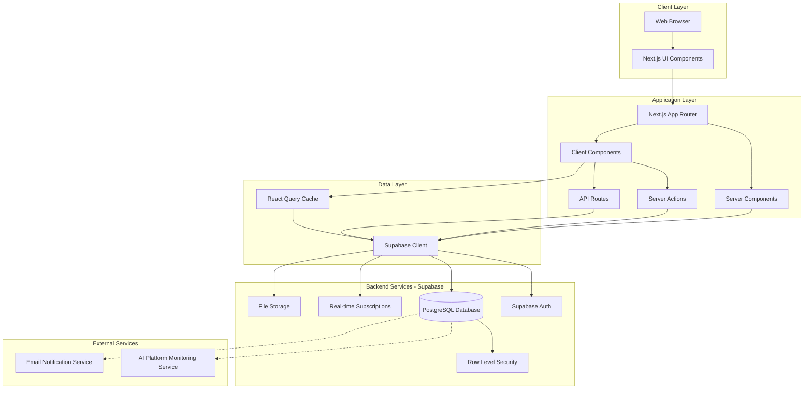

# Tasarım Dokümanı: GEO Dashboard

## Genel Bakış

GEO Dashboard, ajansların müşterilerinin AI platformlarındaki marka görünürlüğünü izlemesi, analiz etmesi ve optimize etmesi için tasarlanmış modern bir SaaS platformudur. Sistem, Next.js 14 App Router, TypeScript, Supabase ve modern React ekosistemi kullanılarak geliştirilecektir.

### Temel Mimari Prensipler

1. **Server-First Architecture**: Next.js 14 App Router ile server component'leri öncelikli kullanım
2. **Real-time Data Flow**: Supabase real-time subscriptions ile canlı veri akışı
3. **Type Safety**: End-to-end TypeScript kullanımı
4. **Optimistic UI**: Kullanıcı deneyimi için optimistic updates
5. **Progressive Enhancement**: Temel işlevsellik JavaScript olmadan da çalışmalı
6. **Multi-tenancy**: Ajans bazlı veri izolasyonu ve güvenlik

### Teknoloji Stack Detayları

- **Frontend Framework**: Next.js 14.2+ (App Router, Server Components, Server Actions)
- **Language**: TypeScript 5.3+
- **Styling**: Tailwind CSS 3.4+ (utility-first CSS)
- **UI Components**: Shadcn/ui (Radix UI primitives)
- **Animation**: Framer Motion 11+
- **Charts**: Recharts 2.10+ (React-based charting library)
- **State Management**: React Query (TanStack Query) v5
- **Backend**: Supabase (PostgreSQL, Authentication, Real-time, Storage)
- **Form Handling**: React Hook Form + Zod validation
- **Date Handling**: date-fns
- **Icons**: Lucide React

## Mimari

### Sistem Mimarisi




### Veri Akışı Modeli

1. **Server-Side Rendering (SSR)**:
   - İlk sayfa yüklemesi server component'lerle yapılır
   - Supabase'den veri server-side fetch edilir
   - SEO ve performance için optimize edilmiş

2. **Client-Side Hydration**:
   - Client component'ler hydrate edilir
   - React Query cache başlatılır
   - Real-time subscriptions kurulur

3. **Real-time Updates**:
   - Supabase real-time channels dinlenir
   - Yeni mention/citation geldiğinde otomatik UI güncellenir
   - Optimistic updates ile instant feedback

4. **Mutation Flow**:
   - Server Actions ile form submissions
   - Optimistic updates ile instant UI feedback
   - Background'da Supabase mutation
   - Success/error handling ve revalidation

### Güvenlik Mimarisi

1. **Authentication**: Supabase Auth (JWT-based)
2. **Authorization**: Row Level Security (RLS) policies
3. **Data Isolation**: Tenant-based filtering (client_id)
4. **API Security**: Server Actions ve API routes için middleware
5. **XSS Protection**: React'ın built-in escaping + CSP headers
6. **CSRF Protection**: Next.js built-in CSRF protection

## Component'ler ve Arayüzler

### Sayfa Yapısı (App Router)


```
app/
├── (auth)/
│   ├── login/
│   │   └── page.tsx                 # Login sayfası
│   └── layout.tsx                   # Auth layout (centered, no sidebar)
├── (dashboard)/
│   ├── layout.tsx                   # Dashboard layout (sidebar, header)
│   ├── page.tsx                     # Ana dashboard
│   ├── clients/
│   │   ├── page.tsx                 # Müşteri listesi
│   │   ├── [clientId]/
│   │   │   └── page.tsx             # Müşteri detay
│   │   └── new/
│   │       └── page.tsx             # Yeni müşteri ekleme
│   ├── visibility/
│   │   └── page.tsx                 # AI Visibility Tracking
│   ├── mentions/
│   │   └── page.tsx                 # Brand Mentions
│   ├── competitors/
│   │   └── page.tsx                 # Competitor Analysis
│   ├── citations/
│   │   └── page.tsx                 # Citation Forensics
│   ├── optimizations/
│   │   └── page.tsx                 # Content Optimizations
│   ├── hallucinations/
│   │   └── page.tsx                 # Hallucination Detection
│   ├── trends/
│   │   └── page.tsx                 # Historical Trends
│   ├── alerts/
│   │   └── page.tsx                 # Alerts & Notifications
│   └── settings/
│       ├── page.tsx                 # Settings ana sayfa
│       ├── profile/
│       │   └── page.tsx             # Company profile
│       ├── users/
│       │   └── page.tsx             # User management
│       └── white-label/
│           └── page.tsx             # White-label config
└── api/
    ├── webhooks/
    │   └── route.ts                 # Webhook endpoint
    └── export/
        └── route.ts                 # Data export endpoint
```

### Core Component'ler

#### 1. Layout Component'leri

**DashboardLayout** (`app/(dashboard)/layout.tsx`):
```typescript
interface DashboardLayoutProps {
  children: React.ReactNode;
}

// Server Component
// - Sidebar navigation
// - Header with client selector
// - User menu
// - Real-time notification bell
```

**Sidebar** (`components/layout/sidebar.tsx`):
```typescript
interface SidebarProps {
  currentPath: string;
}

// Client Component
// - Navigation links
// - Active state management
// - Collapsible on mobile
// - White-label logo display
```

**Header** (`components/layout/header.tsx`):
```typescript
interface HeaderProps {
  clients: Client[];
  currentClientId: string | null;
}

// Client Component
// - Client selector dropdown
// - Search bar
// - Notification bell
// - User avatar menu
```

#### 2. Dashboard Component'leri

**MetricCard** (`components/dashboard/metric-card.tsx`):
```typescript
interface MetricCardProps {
  title: string;
  value: number | string;
  change?: number;
  changeType?: 'increase' | 'decrease';
  icon?: React.ReactNode;
  trend?: number[];
  loading?: boolean;
}

// Client Component
// - Animated number transitions
// - Sparkline chart (optional)
// - Percentage change indicator
// - Click to drill-down
```

**VisibilityTrendsChart** (`components/dashboard/visibility-trends-chart.tsx`):
```typescript
interface VisibilityTrendsChartProps {
  data: TrendDataPoint[];
  dateRange: DateRange;
  platforms: Platform[];
}

interface TrendDataPoint {
  date: string;
  [platformId: string]: number | string;
}

// Client Component
// - Multi-line chart (Recharts)
// - Platform toggle filters
// - Date range selector
// - Responsive design
```

**LiveMentionsFeed** (`components/dashboard/live-mentions-feed.tsx`):
```typescript
interface LiveMentionsFeedProps {
  clientId: string;
  limit?: number;
}

// Client Component
// - Real-time Supabase subscription
// - Auto-scroll to new mentions
// - Sentiment badge
// - Platform icon
// - Animated entry
```

#### 3. Data Display Component'leri

**DataTable** (`components/ui/data-table.tsx`):
```typescript
interface DataTableProps<T> {
  columns: ColumnDef<T>[];
  data: T[];
  pagination?: boolean;
  sorting?: boolean;
  filtering?: boolean;
  onRowClick?: (row: T) => void;
}

// Client Component (TanStack Table)
// - Sortable columns
// - Filterable columns
// - Pagination
// - Row selection
// - Responsive (card view on mobile)
```

**HeatMap** (`components/charts/heat-map.tsx`):
```typescript
interface HeatMapProps {
  data: HeatMapCell[][];
  xLabels: string[];
  yLabels: string[];
  colorScale: [string, string];
}

interface HeatMapCell {
  value: number;
  label?: string;
}

// Client Component
// - Topic x Platform heatmap
// - Tooltip on hover
// - Color gradient
// - Responsive grid
```

**RadarChart** (`components/charts/radar-chart.tsx`):
```typescript
interface RadarChartProps {
  data: RadarDataPoint[];
  categories: string[];
  series: RadarSeries[];
}

interface RadarSeries {
  name: string;
  color: string;
  data: number[];
}

// Client Component (Recharts)
// - Competitive landscape visualization
// - Multiple series support
// - Legend
// - Responsive
```

#### 4. Form Component'leri

**ClientForm** (`components/forms/client-form.tsx`):
```typescript
interface ClientFormProps {
  initialData?: Partial<Client>;
  onSubmit: (data: ClientFormData) => Promise<void>;
  onCancel: () => void;
}

interface ClientFormData {
  name: string;
  domain: string;
  logo?: File;
  industry: string;
  platforms: string[];
}

// Client Component (React Hook Form + Zod)
// - Validation
// - File upload for logo
// - Multi-select for platforms
// - Optimistic submission
```

**AlertRuleForm** (`components/forms/alert-rule-form.tsx`):
```typescript
interface AlertRuleFormProps {
  clientId: string;
  onSubmit: (data: AlertRuleData) => Promise<void>;
}

interface AlertRuleData {
  name: string;
  metric: 'mentions' | 'sentiment' | 'citations' | 'hallucinations';
  condition: 'above' | 'below' | 'equals';
  threshold: number;
  enabled: boolean;
}

// Client Component
// - Dynamic form based on metric type
// - Validation
// - Preview of rule logic
```

#### 5. Specialized Component'ler

**KanbanBoard** (`components/optimizations/kanban-board.tsx`):
```typescript
interface KanbanBoardProps {
  optimizations: Optimization[];
  onMove: (id: string, newStatus: OptimizationStatus) => Promise<void>;
}

type OptimizationStatus = 'todo' | 'in_progress' | 'done';

// Client Component (dnd-kit)
// - Drag and drop
// - Three columns
// - Card preview
// - Optimistic updates
```

**SentimentGauge** (`components/mentions/sentiment-gauge.tsx`):
```typescript
interface SentimentGaugeProps {
  score: number; // -1 to 1
  size?: 'sm' | 'md' | 'lg';
}

// Client Component
// - Circular gauge visualization
// - Color gradient (red to green)
// - Animated needle
```

**CompetitorComparison** (`components/competitors/competitor-comparison.tsx`):
```typescript
interface CompetitorComparisonProps {
  clientData: CompetitorMetrics;
  competitorsData: CompetitorMetrics[];
}

interface CompetitorMetrics {
  name: string;
  mentions: number;
  citations: number;
  sentiment: number;
  shareOfVoice: number;
}

// Client Component
// - Bar chart comparison
// - Sortable metrics
// - Highlight client
```

### Server Actions

**Client Actions** (`app/actions/client-actions.ts`):
```typescript
'use server'

export async function createClient(data: ClientFormData): Promise<Result<Client>>
export async function updateClient(id: string, data: Partial<ClientFormData>): Promise<Result<Client>>
export async function deleteClient(id: string): Promise<Result<void>>
export async function getClientById(id: string): Promise<Result<Client>>
export async function getClientsByAgency(): Promise<Result<Client[]>>
```

**Mention Actions** (`app/actions/mention-actions.ts`):
```typescript
'use server'

export async function getMentionsByClient(clientId: string, filters?: MentionFilters): Promise<Result<Mention[]>>
export async function updateMentionSentiment(id: string, sentiment: Sentiment): Promise<Result<Mention>>
export async function exportMentions(clientId: string, format: ExportFormat): Promise<Result<string>>
```

**Alert Actions** (`app/actions/alert-actions.ts`):
```typescript
'use server'

export async function createAlertRule(data: AlertRuleData): Promise<Result<AlertRule>>
export async function checkAlertRules(): Promise<Result<Alert[]>>
export async function markAlertAsRead(id: string): Promise<Result<void>>
```

### API Routes

**Webhook Handler** (`app/api/webhooks/route.ts`):
```typescript
export async function POST(request: Request): Promise<Response>

// Handles incoming webhooks from AI monitoring service
// - Validates webhook signature
// - Processes mention/citation data
// - Triggers real-time updates
// - Creates alerts if rules match
```

**Export Handler** (`app/api/export/route.ts`):
```typescript
export async function GET(request: Request): Promise<Response>

// Generates export files
// - Supports CSV, PDF, JSON
// - Streams large files
// - Requires authentication
// - Rate limited
```

## Veri Modelleri

### Supabase Database Schema


#### TypeScript Interfaces

```typescript
// Core Types
interface Client {
  id: string;
  agency_id: string;
  name: string;
  domain: string;
  logo_url: string | null;
  industry: string;
  created_at: string;
  updated_at: string;
  health_score: number; // 0-100
  active_platforms: string[];
}

interface Platform {
  id: string;
  name: 'ChatGPT' | 'Perplexity' | 'Google AI Overviews' | 'Claude' | 'Bing Copilot';
  slug: string;
  icon_url: string;
  active: boolean;
}

interface Mention {
  id: string;
  client_id: string;
  platform_id: string;
  query: string;
  content: string;
  sentiment: 'positive' | 'neutral' | 'negative';
  sentiment_score: number; // -1 to 1
  detected_at: string;
  created_at: string;
  metadata: Record<string, any>;
}

interface Citation {
  id: string;
  client_id: string;
  platform_id: string;
  query: string;
  source_url: string;
  source_type: 'wikipedia' | 'reddit' | 'review_site' | 'news' | 'blog' | 'other';
  authority_score: number; // 0-100
  detected_at: string;
  created_at: string;
  status: 'active' | 'lost';
}

interface Competitor {
  id: string;
  client_id: string;
  name: string;
  domain: string;
  created_at: string;
}

interface Query {
  id: string;
  client_id: string;
  text: string;
  category: string;
  priority: 'low' | 'medium' | 'high';
  created_at: string;
}

interface Optimization {
  id: string;
  client_id: string;
  title: string;
  description: string;
  impact: 'low' | 'medium' | 'high';
  effort: 'low' | 'medium' | 'high';
  status: 'todo' | 'in_progress' | 'done';
  readiness_score: number; // 0-100
  created_at: string;
  updated_at: string;
  completed_at: string | null;
}

interface Hallucination {
  id: string;
  client_id: string;
  platform_id: string;
  query: string;
  incorrect_info: string;
  correct_info: string;
  risk_level: 'critical' | 'high' | 'medium' | 'low';
  detected_at: string;
  corrected_at: string | null;
  status: 'open' | 'corrected' | 'monitoring';
}

interface AlertRule {
  id: string;
  client_id: string;
  name: string;
  metric: 'mentions' | 'sentiment' | 'citations' | 'hallucinations' | 'competitor_movement';
  condition: 'above' | 'below' | 'equals' | 'changes_by';
  threshold: number;
  enabled: boolean;
  created_at: string;
}

interface Alert {
  id: string;
  alert_rule_id: string;
  client_id: string;
  title: string;
  message: string;
  severity: 'info' | 'warning' | 'critical';
  read: boolean;
  created_at: string;
}

interface User {
  id: string;
  agency_id: string;
  email: string;
  full_name: string;
  role: 'admin' | 'editor' | 'viewer';
  avatar_url: string | null;
  created_at: string;
  last_login: string | null;
}

interface Agency {
  id: string;
  name: string;
  logo_url: string | null;
  primary_color: string;
  secondary_color: string;
  custom_domain: string | null;
  created_at: string;
}

// Computed/Aggregated Types
interface DashboardMetrics {
  ai_sov: number; // AI Share of Voice percentage
  total_citations: number;
  sentiment_score: number; // -1 to 1
  estimated_traffic_value: number; // USD
  mention_count: number;
  positive_mention_percentage: number;
  neutral_mention_percentage: number;
  negative_mention_percentage: number;
  trend_data: TrendDataPoint[];
}

interface TrendDataPoint {
  date: string;
  mentions: number;
  citations: number;
  sentiment: number;
  [platformId: string]: number | string;
}

interface CompetitorMetrics {
  competitor_id: string;
  name: string;
  mentions: number;
  citations: number;
  sentiment: number;
  share_of_voice: number;
}

interface GapAnalysisResult {
  query: string;
  competitors_present: string[];
  client_present: boolean;
  opportunity_score: number; // 0-100
}

// Form Types
interface ClientFormData {
  name: string;
  domain: string;
  logo?: File;
  industry: string;
  platforms: string[];
}

interface AlertRuleData {
  name: string;
  metric: AlertRule['metric'];
  condition: AlertRule['condition'];
  threshold: number;
  enabled: boolean;
}

// Filter Types
interface MentionFilters {
  platforms?: string[];
  sentiment?: ('positive' | 'neutral' | 'negative')[];
  dateRange?: DateRange;
  searchQuery?: string;
}

interface DateRange {
  from: Date;
  to: Date;
}

// Result Type for Server Actions
type Result<T> = 
  | { success: true; data: T }
  | { success: false; error: string };
```

#### Database Tables (SQL Schema)

```sql
-- Agencies table
CREATE TABLE agencies (
  id UUID PRIMARY KEY DEFAULT uuid_generate_v4(),
  name TEXT NOT NULL,
  logo_url TEXT,
  primary_color TEXT DEFAULT '#3b82f6',
  secondary_color TEXT DEFAULT '#8b5cf6',
  custom_domain TEXT,
  created_at TIMESTAMPTZ DEFAULT NOW()
);

-- Users table (extends Supabase auth.users)
CREATE TABLE users (
  id UUID PRIMARY KEY REFERENCES auth.users(id),
  agency_id UUID REFERENCES agencies(id) ON DELETE CASCADE,
  email TEXT NOT NULL UNIQUE,
  full_name TEXT NOT NULL,
  role TEXT NOT NULL CHECK (role IN ('admin', 'editor', 'viewer')),
  avatar_url TEXT,
  created_at TIMESTAMPTZ DEFAULT NOW(),
  last_login TIMESTAMPTZ
);

-- Clients table
CREATE TABLE clients (
  id UUID PRIMARY KEY DEFAULT uuid_generate_v4(),
  agency_id UUID REFERENCES agencies(id) ON DELETE CASCADE,
  name TEXT NOT NULL,
  domain TEXT NOT NULL,
  logo_url TEXT,
  industry TEXT NOT NULL,
  health_score INTEGER DEFAULT 0 CHECK (health_score >= 0 AND health_score <= 100),
  active_platforms TEXT[] DEFAULT '{}',
  created_at TIMESTAMPTZ DEFAULT NOW(),
  updated_at TIMESTAMPTZ DEFAULT NOW()
);

-- Platforms table
CREATE TABLE platforms (
  id UUID PRIMARY KEY DEFAULT uuid_generate_v4(),
  name TEXT NOT NULL UNIQUE,
  slug TEXT NOT NULL UNIQUE,
  icon_url TEXT,
  active BOOLEAN DEFAULT true
);

-- Mentions table
CREATE TABLE mentions (
  id UUID PRIMARY KEY DEFAULT uuid_generate_v4(),
  client_id UUID REFERENCES clients(id) ON DELETE CASCADE,
  platform_id UUID REFERENCES platforms(id),
  query TEXT NOT NULL,
  content TEXT NOT NULL,
  sentiment TEXT NOT NULL CHECK (sentiment IN ('positive', 'neutral', 'negative')),
  sentiment_score DECIMAL(3,2) CHECK (sentiment_score >= -1 AND sentiment_score <= 1),
  detected_at TIMESTAMPTZ NOT NULL,
  created_at TIMESTAMPTZ DEFAULT NOW(),
  metadata JSONB DEFAULT '{}'
);

-- Citations table
CREATE TABLE citations (
  id UUID PRIMARY KEY DEFAULT uuid_generate_v4(),
  client_id UUID REFERENCES clients(id) ON DELETE CASCADE,
  platform_id UUID REFERENCES platforms(id),
  query TEXT NOT NULL,
  source_url TEXT NOT NULL,
  source_type TEXT NOT NULL CHECK (source_type IN ('wikipedia', 'reddit', 'review_site', 'news', 'blog', 'other')),
  authority_score INTEGER CHECK (authority_score >= 0 AND authority_score <= 100),
  detected_at TIMESTAMPTZ NOT NULL,
  created_at TIMESTAMPTZ DEFAULT NOW(),
  status TEXT DEFAULT 'active' CHECK (status IN ('active', 'lost'))
);

-- Competitors table
CREATE TABLE competitors (
  id UUID PRIMARY KEY DEFAULT uuid_generate_v4(),
  client_id UUID REFERENCES clients(id) ON DELETE CASCADE,
  name TEXT NOT NULL,
  domain TEXT NOT NULL,
  created_at TIMESTAMPTZ DEFAULT NOW(),
  UNIQUE(client_id, domain)
);

-- Queries table
CREATE TABLE queries (
  id UUID PRIMARY KEY DEFAULT uuid_generate_v4(),
  client_id UUID REFERENCES clients(id) ON DELETE CASCADE,
  text TEXT NOT NULL,
  category TEXT NOT NULL,
  priority TEXT DEFAULT 'medium' CHECK (priority IN ('low', 'medium', 'high')),
  created_at TIMESTAMPTZ DEFAULT NOW()
);

-- Optimizations table
CREATE TABLE optimizations (
  id UUID PRIMARY KEY DEFAULT uuid_generate_v4(),
  client_id UUID REFERENCES clients(id) ON DELETE CASCADE,
  title TEXT NOT NULL,
  description TEXT NOT NULL,
  impact TEXT NOT NULL CHECK (impact IN ('low', 'medium', 'high')),
  effort TEXT NOT NULL CHECK (effort IN ('low', 'medium', 'high')),
  status TEXT DEFAULT 'todo' CHECK (status IN ('todo', 'in_progress', 'done')),
  readiness_score INTEGER CHECK (readiness_score >= 0 AND readiness_score <= 100),
  created_at TIMESTAMPTZ DEFAULT NOW(),
  updated_at TIMESTAMPTZ DEFAULT NOW(),
  completed_at TIMESTAMPTZ
);

-- Hallucinations table
CREATE TABLE hallucinations (
  id UUID PRIMARY KEY DEFAULT uuid_generate_v4(),
  client_id UUID REFERENCES clients(id) ON DELETE CASCADE,
  platform_id UUID REFERENCES platforms(id),
  query TEXT NOT NULL,
  incorrect_info TEXT NOT NULL,
  correct_info TEXT NOT NULL,
  risk_level TEXT NOT NULL CHECK (risk_level IN ('critical', 'high', 'medium', 'low')),
  detected_at TIMESTAMPTZ NOT NULL,
  corrected_at TIMESTAMPTZ,
  status TEXT DEFAULT 'open' CHECK (status IN ('open', 'corrected', 'monitoring')),
  created_at TIMESTAMPTZ DEFAULT NOW()
);

-- Alert Rules table
CREATE TABLE alert_rules (
  id UUID PRIMARY KEY DEFAULT uuid_generate_v4(),
  client_id UUID REFERENCES clients(id) ON DELETE CASCADE,
  name TEXT NOT NULL,
  metric TEXT NOT NULL CHECK (metric IN ('mentions', 'sentiment', 'citations', 'hallucinations', 'competitor_movement')),
  condition TEXT NOT NULL CHECK (condition IN ('above', 'below', 'equals', 'changes_by')),
  threshold DECIMAL NOT NULL,
  enabled BOOLEAN DEFAULT true,
  created_at TIMESTAMPTZ DEFAULT NOW()
);

-- Alerts table
CREATE TABLE alerts (
  id UUID PRIMARY KEY DEFAULT uuid_generate_v4(),
  alert_rule_id UUID REFERENCES alert_rules(id) ON DELETE CASCADE,
  client_id UUID REFERENCES clients(id) ON DELETE CASCADE,
  title TEXT NOT NULL,
  message TEXT NOT NULL,
  severity TEXT NOT NULL CHECK (severity IN ('info', 'warning', 'critical')),
  read BOOLEAN DEFAULT false,
  created_at TIMESTAMPTZ DEFAULT NOW()
);

-- Indexes for performance
CREATE INDEX idx_mentions_client_id ON mentions(client_id);
CREATE INDEX idx_mentions_platform_id ON mentions(platform_id);
CREATE INDEX idx_mentions_detected_at ON mentions(detected_at DESC);
CREATE INDEX idx_citations_client_id ON citations(client_id);
CREATE INDEX idx_citations_status ON citations(status);
CREATE INDEX idx_alerts_client_id_read ON alerts(client_id, read);
CREATE INDEX idx_optimizations_client_status ON optimizations(client_id, status);

-- Row Level Security (RLS) Policies
ALTER TABLE clients ENABLE ROW LEVEL SECURITY;
ALTER TABLE mentions ENABLE ROW LEVEL SECURITY;
ALTER TABLE citations ENABLE ROW LEVEL SECURITY;
ALTER TABLE competitors ENABLE ROW LEVEL SECURITY;
ALTER TABLE queries ENABLE ROW LEVEL SECURITY;
ALTER TABLE optimizations ENABLE ROW LEVEL SECURITY;
ALTER TABLE hallucinations ENABLE ROW LEVEL SECURITY;
ALTER TABLE alert_rules ENABLE ROW LEVEL SECURITY;
ALTER TABLE alerts ENABLE ROW LEVEL SECURITY;

-- RLS Policy: Users can only access data from their agency's clients
CREATE POLICY "Users can view their agency's clients"
  ON clients FOR SELECT
  USING (agency_id = (SELECT agency_id FROM users WHERE id = auth.uid()));

CREATE POLICY "Users can view mentions for their agency's clients"
  ON mentions FOR SELECT
  USING (client_id IN (SELECT id FROM clients WHERE agency_id = (SELECT agency_id FROM users WHERE id = auth.uid())));

-- Similar policies for other tables...
```

### Computed Metrics and Aggregations

**AI Share of Voice (AI_SoV) Calculation**:
```typescript
function calculateAISoV(clientMentions: number, totalMentions: number): number {
  if (totalMentions === 0) return 0;
  return (clientMentions / totalMentions) * 100;
}
```

**Sentiment Score Aggregation**:
```typescript
function calculateAverageSentiment(mentions: Mention[]): number {
  if (mentions.length === 0) return 0;
  const sum = mentions.reduce((acc, m) => acc + m.sentiment_score, 0);
  return sum / mentions.length;
}
```

**Health Score Calculation**:
```typescript
function calculateHealthScore(metrics: {
  mentionCount: number;
  citationCount: number;
  sentimentScore: number;
  hallucinationCount: number;
}): number {
  // Weighted formula
  const mentionScore = Math.min(metrics.mentionCount / 100, 1) * 30;
  const citationScore = Math.min(metrics.citationCount / 50, 1) * 30;
  const sentimentScore = ((metrics.sentimentScore + 1) / 2) * 30;
  const hallucinationPenalty = Math.min(metrics.hallucinationCount * 2, 10);
  
  return Math.round(mentionScore + citationScore + sentimentScore - hallucinationPenalty);
}
```

**Estimated Traffic Value**:
```typescript
function calculateEstimatedTrafficValue(citations: Citation[]): number {
  // Simplified: $5 per citation from high-authority source
  const highAuthorityCitations = citations.filter(c => c.authority_score >= 70);
  return highAuthorityCitations.length * 5;
}
```

